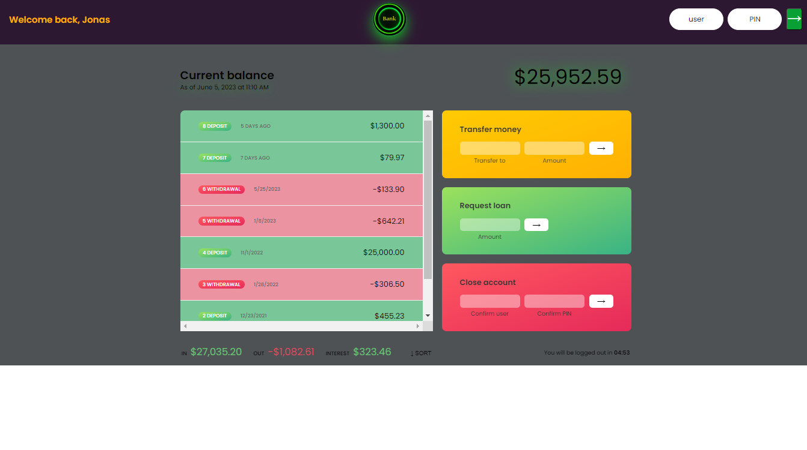

# Udemy JavaScript Complete Course

## Welcome! 👋

Thanks for checking out this coding practice.

[Udemy course](https://www.udemy.com/course/the-complete-javascript-course/) One of the best courses to learn JS!

**To do this practice , you need a basic understanding of HTML, CSS and intermediate JavaScript**

## The goal

The goal is to implement a bank account page that shows transactions and also perform them. Then, outputs a summary of statistics for the corresponding account.
there are two imgainary accounts in this page, 
Username and Pass are:
- Username: js, PIN: 1111
- Username: jd, PIN: 2222

# TOPICS COVERED: 

- Arrays and more than 20 methods including {
    [arr.slice()
    [arr.splice()
    [arr.reverse()
    [arr.concat()
    [arr.join()
    [arr.forEach()
    [*arr.map()*
    [arr.filter()
    [*arr.reduce()*
    [arr.find()
    [arr.some()
    [arr.every()
    [arr.flat()
    [arr.flatMap()
    [arr.sort()
    [new Array
    [Array.fill()
    [new Array.from()

}
- Number and Dates and related methods{

    [Number()
    [Number.parsInt()
    [Number.parsFloat()
    [Number.isNaN()
    [Number.IsFinite()
    [Number.isInteger()

    [Math.sqrt()
    [Math.max()
    [Math.min()
    [Math.PI()
    [Math.random()
    [Math.ciel()
    [Math.floor()
    [Math.toFixed()

    [remainder operator *--- % ---*
    [Numeric separator   *--- 100_100_100 ----*

    [Number.MAX_SAFE_INTEGER
    [BigInt()

    # Date and Time

    [new Date()
    [time stamp >> Date.getTime() >> consol.log(+*time*)
    [Date.getFullYear()
    [Date.getmonth()
    [Date.getDate()
    [Date.getDay()

    [Date.getHours()
    [Date.getMinutes()
    [Date.getSeconds()

    [Date.toISOstring()

    [date.setFullYear()
    [Intl.DateTimeFormat('en-US)
    [()
    # new Intl.DateTimeFormat(navigator.locale).format()
    # new Intl.DateTimeFormat(navigator.language).format
    [Intl.DateTimeFormat('en-US)
    [Intl.DateTimeFormat('en-US)

}

# SET TIMEOUT and INTERVALS 
- {
    
    [setTimeout()
    [setInterval()
    [clearTimeout()
    [clearIntervals()

}

- Addet animated counter
- Mobile layout
- some visual features
- logic is exactly as designed by the author, but the code and functions are all rewrited and implemented by me.

**Have fun building!** 👩‍💻👩‍💻👩‍💻👩‍💻👩‍💻👩‍💻 
